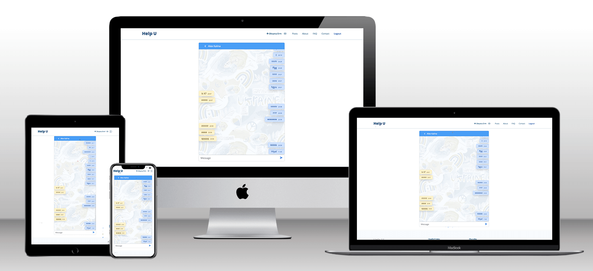
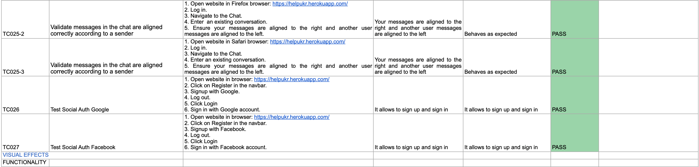
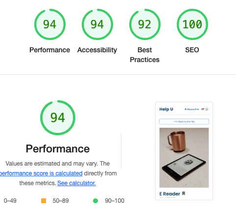

# Help U Website (Milestone Project 4)

[Help U](https://helpukr.herokuapp.com/) is a platform that aims to support Ukrainian refugees in Europe and connect people. The website serves as a bridge between those looking to make a difference and those who need help by providing a platform for offering or requesting free services and items such as clothing, furniture, and other necessities. The goal of the website is to create a community of support for Ukrainians who have fled the war and to make it easy for people to get the help they need. The ongoing conflict has had a devastating impact on ordinary people, and it is important to support their rights and dignity. It is a very personal and sensitive issue for many people, including myself, because it affects the country of my heritage and identity. It is important to me as a human being, to support the Ukrainian people and help them to rebuild their lives. 

## Table of contents

* [Purpose](#purpose)

* [UX Design](#ux-design)
  * [User Stories](#user-stories)
  * [UAC](#uac)
  * [Structure](#structure)

* [Wireframes](#wireframes)

* [Design](#design)

* [Development Plan](#development-plan)

* [Architecture](#architecture)

* [Data Model](#data-model)

* [Features](#features)
  * [Feature Considerations](#feature-considerations)

* [Testing](#testing)
  * [User Story Testing](#user-story-testing)
  * [Manual Testing](#manual-testing)
  * [Unit Testing](#unit-testing)
    * [Python unit tests](python-unit-tests)
    * [JS unit tests](js-unit-tests)
  * [Automated Testing](#automated-testing)
      * [Selenium Tests](#selenium-tests)
      * [Code Validation](#code-validation)
      * [Lighthouse](#lighthouse)

* [Technologies](#technologies)
  * [Languages](#languages)
  * [Programs, frameworks, libraries](#programs,-frameworks,-libraries)

* [Deployment](#deployment)

* [Credits](#credits)

# Purpose
The website is built using the Django framework, which provides the backend functionality, such as user authentication, data management, and routing, and handles the majority of the frontend. One key feature of the website is a React component that allows real-time communication and updates through the use of WebSockets. This allows a seamless and interactive user experience as certain parts of the website update in real-time without the need for page refreshes. Overall, the website combines the power and flexibility of Django with the dynamic capabilities of React and WebSockets to deliver a smooth and responsive user experience.

The website provides all the essential features, such as creating a personal account, searching and filtering posts, ability to add and manage posts, bookmark posts the users find usefull, comment on posts and send direct messages to other users in real time. 

The website is developed as a Milestone Project#4 for the Code Institute's Full Stack Developer course.  

[The live website is available here](https://helpukr.herokuapp.com/)
___
# UX Design
## User stories

Target audiences:
- Ukrainian refugees in Europe who are in need of assistance and other necessities. (U)
- Individuals who are interested in supporting Ukrainian refugees and want to find an easy way to make a difference. (I)
- Organizations or groups that provide aid to refugees and may be interested in using the platform to connect with potential donors or volunteers. (0)

All target groups have similar needs and purposes, with the only difference - the category of the post.

### As a **first time user**

- I want to be able to access the website from any device.
- I want to easily understand the main purpose of the site and learn more about the topic.
- I want to be able to easily navigate and find content.
- I want to create my personal account to see posts.
- I want to sign up with my social accounts, such as Google or Facebook.
- I want to create an account fast, but I want it to be secure.
- I want to be able to contact somebody and receive a response without signing up if I have doubts or queries.
- I want to easily access a category of posts I need and to be able to search through them.
- I want to open a post in a separate page to see all the details.
- I want a map attached to each posts to understand where the offer/request is.
- I want to be able to create a post myself.
- I want to contact another user if I see something that interests me.
- I want to know more about other users that I interact with.
- I want to be immediately notified when another user responds.
- I want to learn more about the project on social media.
- I want to receive feedback from the website about what's happening to know if something went wrong.

- I want a messenger to translate messages to ukrainian for me. (U)

### As a **returning user**

- I want to be sure my data is protected.

- I want to be notified about the messages I received.

- I want to access the messenger from anywhere on the website.

- I want to be able to access the navbar at any point or go back to the top to navigate fast.

- I want posts to be paginated so it helps me remember on what page I saw something interesting or stay on the same page if I accidentially refresh the page or there are problems with internet connection.

- I want to be able to report content that I find offensive, unsafe or inappropriate.

- I want content to be moderated, so I don't need to report it.

- I want to be able to write comments to describe my experince of interacting with an offer.

- I want to be able to update and delete my posts.

- I want to bookmark posts and easily access them.

- I want to be able to update my user profile.

- I want to be able to reset my password if I forget it.

___
## UAC
User Acceptance Criteria based on the user stories:

1. The website should be fully responsive and accessible on any device, including desktop, tablet, and mobile.

2.  The website should have a clear and concise homepage that explains the main purpose and topic of the site.

3.  The website should have a clear and intuitive navigation menu that allows users to easily find and access content.

4.  The website should have a navigation bar that is always visible and easily accessible from any page on the site, and a button to quickly scroll back to the top of the page.

5.  The website should have a registration form that allows users to create a personal account.

6.  The website should allow users to sign up with their existing social media accounts, such as Google or Facebook.

7.  The registration process should be fast and easy, but also secure, using encryption and other security measures.

8.   The website should have a contact form or email address that allows users to contact the site's support team without needing to sign up.

9.  The website should have a search bar that allows users to easily find and access specific categories of posts.

10.  Each post should have a link that allows users to view it in a separate page, where they can see all the details and information about the post.

11.  Each post should have a map attached that displays the location of the offer or request.

12.  The website should have a form that allows registered users to create their own posts.

13.  Each post should have a contact button or form that allows users to contact the author of the post.

14.  The website should have a user profile page that displays information about other users that a user interacts with.

15.  The website should display live notifications to users when another user responds to their message.

16.  The website should have links to its social media pages, such as Facebook, Twitter, Instagram, etc.

17.  The website should have a feedback form or email address that users can use to report any issues or problems they encounter while using the site.

18.  The website should have a messenger feature that allows users to communicate with each other.

19.  The messenger should support Ukrainian language and should be able to translate messages to Ukrainian.

20.  The website should be localized to support Ukrainian language and have the option to switch to Ukrainian.

21.  The website should have robust security measures in place to protect user data, such as encryption and secure servers.

22.  The messenger should be easily accessible from any page on the site.

23.  The website should divide the posts into pages so that users can easily navigate through them.

24.  The website should have a reporting system that allows users to flag content that they find offensive, unsafe or inappropriate.

25.  The website should have a moderation system that reviews and approves or removes content that does not meet the standards of the website.

26.  The website should allow registered users to leave comments on posts, in order to share their experience and feedback.

27.  The website should allow registered users to edit and delete their own posts, if they need to.

28.  The website should allow registered users to bookmark posts and have easy access to them for later reference.

29.  The website should allow registered users to update their profile information and personal details.

30.  The website should have a password reset feature that allows registered users to reset their password in case they forget it.

31.  The website should provide feedback about the status of the processes.
___
## Structure
  ** Some paddings slightly differ from the original website, it didn't display acccurately in x-frames of a mockup generator.

### Home Page

- Explains the main purpose and topic of the site.
- Adresses question and doubts the first time users might have and provides a contact form.
- Presents opportunities of possible further actions 
    #### User Goal:
    >   - Understand the main purpose of the website.
    >   - Be able to contact the site owners to ask more questions or report technical problems signingup/in.
    >   - Easily navigate and interact with the website.
    >   - Learn more about the project on social media.
    #### Website Goal:
    >   - Inform the user about the main purpose.
    >   - Interest and engage the user.
    >   - Call to action.
    >   - Initiate future engagement, such as following on social media, joining the club, attending meetups etc.
    >   - Provide aesthetically pleasing user experience.

### Sign Up Page

- Allows to sign up.
- Allows to sign up with existing social media account.
    #### User Goal:
    >   - Sign up.

    #### Website Goal:
    >   - Allow the user to sign up easily.
    >   - Provide aesthetically pleasinguser experience.

### Sign In Page

- Allows to sign in.
- Allows to sign in with existing social media account.
    #### User Goal:
    >   - Sign in.
    #### Website Goal:
    >   - Allow the user to sign in easily.
    >   - Provide aesthetically pleasinguser experience.

### Posts Page

- Shows posts.
- Allows users to easily find and access specific categories of posts.
- Allows to open each post in a separate page.
- Available only for authenticated users.
    #### User Goal:
    >   - Browse the posts.
    >   - Easily find and access specific categories of posts
    >   - Open posts to see them in detail.
    #### Website Goal:
    >   - Provide a list of posts.
    >   - Provide comprehensive information on each post in a preview.
    >   - Provide aesthetically pleasing user experience.

### Post Detail Page

- Shows a post in detail including an image and a map.
- Allows to see and write comments about the post.
- Allows to bookmark the post.
- Allows to contact the author of the post in a messenger.
- Allows to manage the post if you are the author.
- Available only for authenticated users.
    #### User Goal:
    >   - See a post in detail.
    >   - See comments other users left about the post.
    >   - Leave your own comments.
    >   - Bookmark a post.
    >   - Contact the author of the post.
    >   - Manage the post, if you are the author.
    #### Website Goal:
    >   - Show a post in detail.
    >   - Allow the user to interact with the post.
    >   - Allow users to contact each other.
    >   - Provide aesthetically pleasing user experience.

### Create/Update Post Page

- Creates a new post.
- Allows to update an existing post.
- Available only for authenticated users.
    #### User Goal:
    >   - Create a new post.
    >   - Update your posts.
    #### Website Goal:
    >   - Allow the user to create/update a post.
    >   - Provide aesthetically pleasing user experience.

### Delete Post Page

- Confirms if the user wants to delete their post.
- Available only for authenticated users.
    #### User Goal:
    >   - Delete a post.
    >   - Being able to change your mind if you pressed "Delete" accidentially.
    #### Website Goal:
    >   - Confirm with the user deletion of the post.
    >   - Provide aesthetically pleasing user experience.

### Profile Page

- Shows a user profile.
- Shows the user's bookmarked posts.
- Allows to contact the user.
- Available only for authenticated users.
    #### User Goal:
    >   - See a profile in detail.
    >   - See your own bookmarked posts.
    >   - Leran more about other users you are going to interact with.
    >   - Contact another user.
    #### Website Goal:
    >   - Allow users to see their owm and each other's profile.
    >   - Allow the user to see saved posts.
    >   - Allow users to contact each other.
    >   - Provide aesthetically pleasing user experience.

### Profile Create/Update Page

- Manages a user profile.
- Available only for authenticated users.
    #### User Goal:
    >   - Create a new profile (it's created automatically, but the user is asked to complete an empry profile).
    >   - Update your profile.
    #### Website Goal:
    >   - Allow the user to complete/update a profile.
    >   - Provide aesthetically pleasing user experience.

### Messenger Page

- Displays a react component - real time Messenger.
- Allows users to send and receive messages in real time.
- Available only for authenticated users.
    #### User Goal:
    >   - Send and receive messages.
    >   - See a list of active conversations.
    >   - Receive message notifications in real time.
    #### Website Goal:
    >   - Allows users to send and receive messages.
    >   - Displays a list of active conversations and individual chats.
    >   - Provides message notifications in real time.
    >   - Provide aesthetically pleasing user experience.

___
# Wireframes

### Home Page  

click to expand

### Sign In Page

click to expand

### Sign Up Page

click to expand

### Posts Page

click to expand

### Post Detail Page

click to expand

### Profile Page

click to expand

### Messenger

click to expand

### Chat

click to expand

___
# Development Plan

## Agile design

The development of the website has followed an Agile methodology, using GitHub's projects to prioritize and track user stories and features. The approach enabled the implementation of ideas based on their level of importance, ensuring that the website functionality and user experience were not compromised. Following categories were applied, as well as corresponding labels were created:
- must have
- should have
- would have
- could have

The development followed an AGILE approach, which allowed for the delivery of a functional and feature-rich site. The project was constrained by time limitations, which resulted in some initially listed features not being implemented. However, AGILE methodology is increadibly helpful in situations like this, as it allows for the prioritization and tracking of user stories. Completed user stories are in the "Done" section and the ones that were not prioritised for the first iteration are currently in the "To Do" section to be covered in the next iteration. 

[See the current state of the project here.](https://github.com/users/oks-erm/projects/2/views/2?sortedBy%5Bdirection%5D=asc&sortedBy%5BcolumnId%5D=Labels&visibleFields=%5B%22Title%22%2C%22Labels%22%2C%22Assignees%22%2C%22Status%22%2C%22Reviewers%22%5D)
___
# Design

## Design

The website is meant to have a simple layout and a clean design. The home page is aimed at giving a professional and informative impression, whilst cozy and friendly as you log in, which is achieved by little details, such as a cheerful logo and a footer image. A main frame for design, mainly composition and alignment-wise, was a template [One Page](https://bootstrapmade.com/onepage-multipurpose-bootstrap-template/), which was heavily modified with unique imagery and "Ukrainian twist".

### Colour Scheme

The color scheme is mainly blue and white, with a touch of yellow to create a visually appealing and cohesive design that is easily recognizable as being associated with Ukraine. The color scheme is an effective way to create a visual association with the country, it helps to create a sense of familiarity and trust among the visitors. Overall, this color palette creates a sense of calm and trust, with a touch of happiness and energy. The blue shades are associated with reliability, stability and security, while the yellow color adds a touch of cheerfulness and enthusiasm. 

### Typography

[Poppins](https://fonts.google.com/specimen/Poppins) was used for logo for a modern, simple and clean look.

[Raleway](https://fonts.google.com/specimen/Raleway) elegant, with clean lines and a minimalistic design was used for headings.

[Open Sans](https://fonts.google.com/specimen/Open+Sans) neutral and friendly, and a slight informal feeling, was used for the navbar and main body text. Lightweight, easy to read and particularly legible at small sizes and also exists in Ukrainian alphabet, which is not the case for many other fonts. 

### Images

The images in this project were sourced from [Unsplash](https://unsplash.com/) and [Undraw](https://undraw.co/), generated by [Midjourney](https://midjourney.com/home/?callbackUrl=%2Fapp%2F) and [This Person Doesn't exist](https://this-person-does-not-exist.com) or created by me. The logo is designed in [Hatchful](https://www.shopify.com/tools/logo-maker)

### Visual Effects

#### Onscroll Animation
[AOS (Animate on Scroll)](https://michalsnik.github.io/aos/) is used to animate the appearance of different sections on the website as the user scrolls down. This helps to make the website more engaging and enhance the user experience by adding visual interest and dynamic movement to the website. 

#### Shadows
Shadows are used to create a sense of depth and dimension and make elements on the page appear more realistic and three-dimensional. The shadows on the cards and the navbar give them a raised effect, which makes them stand out from the background, especially when white is the dominant colour. Shadows create visual hierarchy, helping to guide the user's attention to the most important elements on the page. Additionally, shadows create a sense of realism, making the elements look like they are actually present in the physical space, making the design look more visually interesting and engaging.

#### Logo
The logo is composed of two leaves arranged to form a heart shape. The use of the yellow and blue colors, which are the colors of the Ukrainian flag, suggests a strong connection to the country and its people. The heart shape is a universal symbol of love and care, that is effectively represents the project's mission and values, this is a powerful and positive message that the project is trying to convey, it's a way to show that we are here to help and support the people of Ukraine.

The simplistic graphic style of the leaves gives the logo a modern and clean look, making it easy to recognize and remember. The leaves also represent life, which align well with the organization's mission of providing help and support. This logo is used throughout the website in the way that almost at any point at the website the logo is present in the view. It conveys a message of love, care, and support while also being visually appealing and easy to recognize.

#### Smooth fade in/out
The use of a smooth fade in and out effect for a Google map toolkit and cards during live search refreshing can provide a sense of continuity and flow to the user experience. The fade in effect can be used to smoothly reveal the updated information to the user, rather than abruptly showing the new data. This can help to prevent confusion and disorientation for the user. The fade out effect is used to smoothly hide the previous data while refreshing the search, which can prevent the user from seeing the previous data that is irrelevant to their current search. This can help to improve the user's focus on the updated information.

#### Hover effect
The navbar links, all links and buttons include a hover-over effect to make the experience more interactive and navigation more intuitive. When the user engages with the link or hovers over the link, its colour or background colour changes.
___
# Architecture

A hybrid architecture - a single page React app (Messenger) integrated into a Django project. This approach allows for multiple types of pages in the same project.

One major advantage of using a hybrid architecture is that it allows for the use of Django's built-in tooling to handle authentication. This means that we can use the @login_required decorator or LoginRequiredMixin on the hybrid Django view serving our template, without having to rely on complex third-party authentication workflows.

Another advantage of a hybrid architecture is the ability to send data to the front-end in two ways: by passing the data directly to the template using Django's built-in templating system, or by providing the data via asynchronous APIs using JavaScript and Django REST framework. This allows for fast data loading using the native fetch API, and the API is loaded by URL and authentication is handled without configuration by the Django session cookie, no wrestling with CORS.

In terms of performance, by using React for the front-end of a web application, in this case just a part - a real-time Messenger, we can take advantage of its performance benefits and provide a smooth and responsive experience for the user. Additionally, React is a highly modular library, and by building a single page app, you can easily scale the different parts of the application independently as needed. This can make it easier to add new features or make changes to the application without affecting other parts of the codebase. It also allows for easier debugging and testing.

As well as the mentioned above, that I prioritised in my project, React for the front-end of can significantly improve the user experience. 
 Here a scheme of the structure:

___
# Data Model

___
# Features

## Auth ([uac 1](#uac1))

Authentication is particularly important for Help U, as the subject is quite sensitive and people are vulnerable asking for help, so it should be confidential within the community and available only for authenticated users. Thus all the website, besides the home page is avalable only for authenticated users. 

### User Authentication ([uac 7](#uac7))

In this project, authentication is implemented using Django AllAuth. The project uses a custom user model with email as a user id, which means that users to register and log in to the website need to use their email address instead of a traditional username.

### User Registration ([uac 5](#uac5))

Even though the website's registration process includes an email as the primary identifier for user accounts, as well as the requirement for users to provide their first and last name. This is to ensure that users are using their real names and photos, which helps to build trust among the community. To verify the authenticity of users and prevent fraud, the registration process includes email verification. In addition, phone number verification will be set up in production using services like WebOTP, Veriphone, or Twilio, to further secure the registration process.
The registration process requires users to enter their password twice to ensure that they have typed it correctly. This is an important security measure, as it helps to prevent users from accidentally entering the wrong password.

### Social Auth ([uac 6](#uac6))
AllAuth allows users to quickly and easily register and log in to the website using their existing social media accounts. In this case Google and Facebook were chosen as the most of the most popular social media platforms in the world, with billions of active users and robust security protocols. This eliminates the need for users to create a new account or remember a separate username and password for the website, which can help to increase user engagement and retention. By offering social authentication options, we can increase the number of users who register for an account on the website. 

Social authentication providers, such as Google and Facebook, have their own security protocols in place to ensure that user's personal information is secure. By using social authentication, we can rely on these established security protocols and increase the security of the website.

### Reset password ([uac 30](#uac30))
The website also provides the password reset feature, which is an important security feature that allows users to reset their password if they have forgotten it or if their account has been compromised. AllAuth sends out an email notification to the user with a link to reset their password, which ensures that only the user can reset the password of their account. The password reset feature provides a better user experience by allowing users to regain access to their account quickly and easily, which helps to increase user engagement and retention.

## Django Messages ([uac 31](#uac31))

Django messages allows to provide users with feedback on the actions they have taken on your website, such as logging in, logging out, registering, creating or updating a post or profile. This improves the user experience by letting them know that their action was successful or by providing them with an error message if something went wrong. Messages persist across different pages, which means that if a user is redirected to a different page after performing an action, the message will still be displayed. This is particularly useful for informing users about the outcome of an action that they have taken.

## Responsive ([uac 1](#uac1))

The website has been designed with flexibility and aesthetic appeal in mind, ensuring that it is responsive and visually pleasing on all screen sizes and resolutions, starting at 350px. 
Responsiveness was achieved by utilizing Bootstrap in combination with JavaScript. This allowed for rearrangement of page components to optimize the user experience on different screen sizes. Breakpoints were chosen based on typical device screen sizes and the goal of provthe best possible presentation of content for all screens. Breakpoints are not strictly consistent *particalarly for smaller screens) but it is done intentionally to provide better presentation of the content for all screens, the 992px breakpoint is common for laptops, the media query at this breakpoint adjusts the font-size of the logo to make it more suitable for smaller screens. The 1200px breakpoint was chosen to target larger desktop screens and ensure that the website looks good on those devices as well, to stop the content from further expanding and make sure that the website layout is not broken or distorted on large screens.

## Accessibility

The website is designed and developed with accessibility in mind: it provides alternative text for images, using semantic HTML elements, aria-labels and providing adequate color contrast.
Keyboard navigation is possible. It's also works with screen readers, however, there's room for improvement in this aspect, to ensure that it is fully accessible to users with disabilities.

## User Profile ([uac 14](#uac14))

The UserProfile model is a separate model from the CustomUser model and is connected to it through a OneToOneField. The UserProfile model contains additional information about the user such as their profile picture, languages they speak, bio, country, and city. The main reason for this is that it allows for better organization and maintainability of the codebase. The CustomUser model contains fields and methods related to user authentication. On the other hand, the UserProfile model contains fields and methods related to user-specific information such as their profile picture, bio and other details. Another advantage of separating the UserProfile model from the CustomUser model is that it allows for the possibility of adding new fields or functionalities to the UserProfile model without affecting the CustomUser model. Also, it can allow for better scaling of the application, as the data of the user profile can grow separately from the data of the user authentication.

The User Profile page is a dedicated page within the website where users can view and edit their personal information such as profile picture, bio, location, languages, as it's essential for the purpose of the website. It is accessible to logged-in users and provides them with a central location to manage their account information ans bookmarked posts. Many fields are required for security reasons, such as the userpic and bio fields. The userpic field is used to display the user's profile picture, which helps in building trust between users and making the website more personal. The bio field is used to provide more information about the user and make it easier for others to connect with them. The country and city fields are also required as they provide additional information about the user's location which is essential for other users to understand if the offer is relevant based on location. 

### Bookmarks ([uac 28](#uac28))

Users have the ability to save posts that they find interesting or relevant for later viewing by bookmarking them. There is a bookmark icon on the right of the post title on the post detail view page. This feature allows users to easily access the posts they have saved and review them at a later time, without having to search for them again. This feature is beneficial for users who come across a post that they would like to refer to later but may not have the time to fully engage with at the moment. It also allows them to curate a collection of posts that they find valuable, which they can refer to again and again.

### Modal 

When a new user confirms their email address, a User Profile instance is automatically created for them. Once they follow the link provided, they are met with the modal that prompts users to complete their profile and this modal does not have an escape option other than following the link and completing the required fields. Whilst possibly controversial, this solution has a particular purpose, such as ensuring that users complete their profile before being able to engage with the content on the website, which can help to improve the overall quality and safety of the community. Requiring users to complete their profile before being able to browse posts helps to ensure that the website has accurate and complete information about its users. This can improve the overall user experience and can also help to foster a sense of community and trust among users. Having a complete user profile can also help to improve the website's performance, as it can be used to personalize the website experience for each user. For example, implemeting geography and showing offers nearby. 

### Update ([uac 29](#uac29))

Users have the ability to update their profile information at any time. This feature allows them to make changes to their personal information and profile picture.
This feature is beneficial for users as it allows them to keep their profile information up to date and accurate, which is in many ways essential for the purpose of the website. It also allows them to update their profile picture to reflect their current appearance. 

Users can access the profile update page by clicking on their name on the top right corner of the website, then clicking on the "Edit Profile" button. Once on the update page, they can edit the fields they wish to change and save the changes by clicking on the "Save" button.

## Page elements

### Loader ([uac 31](#uac31))

The website utilizes visual cues, such as spinners, to indicate that a process is currently in progress and that the website is working to load or complete the requested action. This helps to improve the user experience by providing a visual indication of progress and reducing confusion.

### Navbar ([uac 3](#uac3), [uac 4](#uac4), [uac 22](#uac22))

The navbar is a key feature of the website, located at the top of the page in a sticky position and it is always visible to the user, even when scrolling down the page. The navbar provides a clear and easy way for users to navigate the website. The website name is prominently displayed in the navbar, providing users with a clear indication of the website they are currently visiting. If the user is logged in, the navbar also displays their username, allowing them to quickly identify their own profile. Additionally, there is a messenger icon which is only visible when the user is logged in. This allows users to access the messaging feature and see real time notifications.

The navbar also includes several links that aid navigation on the website. The "About" link provides information about the website and its purpose. The "Contact" link allows users to get in touch with the website's support team. The "FAQ" link is dedicated to frequently asked questions. The "Login" and "Register" links are used for user authentication and are only visible to unauthenticated users. Once the user logs in, they will not see these links anymore and "Log out" will be displayed instead. The page "Posts" are only displayed to authenticated users, otherwise it's "Home" page. The user must be logged in to access all pages on the website, except for the home page. 

### Message Notifications ([uac 15](#uac15))

The website features real-time message notifications that are displayed in a badge on the messenger icon. This means that whenever a new message is received, a notification will be displayed on the messenger icon, informing the user of the new message, this is achieved through the use of websockets. The badge will display the number of unread messages, allowing the user to quickly assess the number of new messages they have received. This feature is designed to improve the user experience by allowing users to quickly and easily access their messages without having to navigate to a different page. Users can access their messages with a single click on the messenger icon, and the badge serves as a visual cue that there is a new message waiting for them.

### Little logo

There is a small logo next to the site name, which is designed to be displayed at all times while the user is browsing the site. This logo appears when the page is scrolled and the hero logo disappears from view. This ensures that the logo is always visible to the user, regardless of their scroll position on the page. The use of a smaller logo when the page is scrolled serves a few key purposes. Firstly, it helps to maintain consistency in branding and visual identity, as the logo is always present and easily recognizable to the user. Secondly, it helps to keep the page from becoming overloaded with multiple logos, which can be visually distracting and confusing.

### Footer ([uac 3](#uac3), [uac 16](#uac16))

The website's footer is designed to provide users with useful information and navigation options in a clear and organized manner. It is split into three columns, each serving a specific purpose. The first column contains external links that may be useful to users on the related topic. The second column includes a duplicate of the site's main navigation menu, allowing users to easily access the pages they are looking for. It also includes links to the website's terms of use and privacy policy, which are important for users to be aware of. The third column contains links to the website's social media profiles, allowing users to connect with the project activists and each other. The footer also includes an image, that gives a sense of warmth and positivity to the website and improve the overall user experience.

### Back to the top ([uac 4](#uac4))

The "back to top" button is located at the bottom right corner of the webpage and appears after the user has scrolled a certain amount down the page. The button is represented by an upward-facing arrow. When clicked, the button uses JavaScript to smoothly scroll the page back to the top, providing a convenient way for users to quickly navigate back to the top of the page without having to manually scroll back up.

### Hero ([uac 2](#uac2))

The hero section of the website is designed to be the first thing that users see when they land on the page. It includes a large logo and motto that helps to convey the website's overall ethos and purpose. The section also features two buttons that address different categories of users. These buttons allow users to quickly navigate to the category of posts that most interests them, whether they are looking to give or receive help. This helps to guide users towards the relevant content and make it easy for them to find what they are looking for, improving the overall user experience.

### About ([uac 2](#uac2))

The "About" section of the website provides information about the purpose and mission behind the website. There is a brief introduction about the organization and its objectives, it also calls the visitor to learn more about the topic, to empathise and engage. 

### FAQ ([uac 2](#uac2))

The FAQ (Frequently Asked Questions) section of a website is dedicated to answers to common questions that visitors may have about the website or the project behind it. This section is organized in a question-and-answer format inside a Bootstrap accordion component. It provides advice on how to interact with other users, as it is most likely unfamiliar international communication. It address concerns about the platform's safety and security, such as how user data is protected, how the platform deals with inappropriate content, and what measures are in place to guarantee the community is safe.

### Contact Form ([uac 8](#uac8), [uac 17](#uac17))

The contact form on the website allows users to easily reach out to the website's support team with any questions or concerns they may have. The form includes fields for the user's name, email address, and message, as well as a subject field for specifying the nature of the inquiry. For logged-in users, the form will automatically fill in the name and email fields with the information provided in the user's profile, saving them time and simplifying the process of reaching out to the support team. The form is handled by JS without refreshing the page.

### Live Search ([uac 9](#uac9))

The live search feature on the website allows users to quickly and easily find the information they are looking for. As the user types in their query, the website dynamically updates the search results in real-time, providing a list of relevant results that match the user's query. This feature is implemented using a combination of JavaScript and a web API that allows the website to quickly search through its database of content and retrieve the most relevant results. The results are displayed in a list format, with the most relevant results appearing at the top. The live search feature is designed to improve the user experience by making it easy for users to find the information they need quickly and easily.

### Type Checkboxes ([uac 9](#uac9))

These checkboxes allow users to filter posts based on whether they are looking to give or receive help. This makes it easy for users to find exactly the kind of posts they are interested in, and streamlines the search process for a better user experience.

### Posts List 

The posts list page is the main hub for users to browse and discover offers that they are interested in. Each post is presented in a card format, with a title, an image, location, and a short description preview. This format allows users to quickly scan through the posts and get a general sense of what each offer is about. Additionally, a map toolkit is also provided to help users understand the location of the offer and how relevant it is to them. This allows for an efficient and user-friendly experience, making it easy for users to find what they are looking for. Users can also filter the posts by checking off "give" or "receive" checkboxes and the posts will be filtered accordingly.

### Pagination ([uac 23](#uac23))

The pagination on the website is set to display 12 posts per page. This means that when a user visits the page with posts, they will see a maximum of 12 posts at a time. If there are more than 12 posts, the user will be able to navigate through the pages using the pagination controls. This allows the user to easily view a specific set of posts and avoid scrolling through a large number of posts at once. Additionally, this feature helps to improve the performance of the website by not loading all the posts at once.

### Type Badges ([uac 9](#uac9))

Type badges appear when both checkboxes are checked to show all offers to distinguish the different types of posts. This allows the user to quickly identify the type of post and make an informed decision about whether or not to engage with it. 

### Post Detail View ([uac 10](#uac10), [uac 11](#uac11), [uac 13](#uac13))

The post detail view provides a detailed view of a specific post. The view includes an image of the offer, a map with a closer view of the location of the offer. The map allows the user to understand the area and neighbourhood of the offer. This map includes different scale, such as a zoomed-in view of the area and neighborhood, compared a more distant scale that is gives on the Posts List page for an approximate understanding of where the city is located. 
There is also a detailed description of the offer, a link to the user profile of the author, and buttons to write a comment and contact the author directly. The "Say thank you" button allows the user to express gratitude for the offer, and the "Contact" button allows the user to proceed with discussing the offer with the author. 

### Comments ([uac 26](#uac26))

The comment section on the post detail view allows users to leave feedback. It is comprised of a list of existing comments that are displayed in chronological order, with the most recent comments appearing at the top. Each comment includes the name and userpic of the person who left the comment, as well as the comment text itself. Additionally, there is a form for users to leave their own comment. The comment section is designed to be intuitive and easy to use, with a clear and simple layout that makes it easy for users to understand the context of the conversation.

### Comment field ([uac 26](#uac26))

The form to leave a comment appears in a collapsible component, when the user clicks the "Say Thank You" button. It is handled by JavaScript without refreshing the page. This allows for a seamless and smooth user experience, as users can leave comments without disrupting their current browsing session.

It is important to note that all comments are moderated to ensure that the content is appropriate and relevant to the post. This helps to maintain a positive and respectful community and ensures that all users have a positive experience while using the website.

### Create/ Update Post ([uac 12](#uac12), [uac 27](#uac27))

The create and update post view is a page that allows users to create or edit a post on the platform. This view includes several fields that users must fill out in order to create or update a post, such as a title, description, location, and image. Users have to choose whether their post is a request for help or an offer of help and a category, such as items, services, support. For updating a post, users can change any fields they wish. The view is designed to be user-friendly and easy to navigate, with clear instructions and prompts for each field.

The new posts are moderated before appearing on the platform, to ensure that it follows the community guidelines.

### Delete Post ([uac 27](#uac27))

The delete post feature allows users to remove a post that they have previously created. This feature is accessible from the post detail view by clicking on a delete button. When the button is clicked, the user is redirected to the page to confirm the deletion. Once the user confirms the deletion, the post will be removed from the website and will no longer be accessible to other users. This feature is designed to help users clean up their profile and ensure that the platform remains organized and relevant for all users.

## Messenger (React App) ([uac 18](#uac18))

The messenger feature on the website is designed to allow users to communicate with each other in real-time. It was built using React and Typescript. It is built into a Django App page and all navigation related to the messenger happens inside it and handled by a React router. The real-time functionality is achieved through the use of websockets and Django Channels, a library that allows Django to handle websockets in addition to traditional HTTP requests. This allows for a seamless and responsive experience where users can receive and send messages instantly, without the need to refresh the page. Users are able to see the message history and receive notifications of new messages.

### Websocket (Django Channels) 

Django Channels is the package that was used to add websocket support to the Django project. Django Channels provides the necessary tools to set up a robust and efficient websocket connection in the project, and enables real-time functionality throughout the website by allowing for real-time notifications and communication. It extends the functionality of Django by allowing the handling of multiple protocols, such as the HTTP protocol which is used by default, and the websocket protocol which enables real-time functionality.

To set up websockets in the project, Django Channels uses an asgi application, which is responsible for handling the HTTP protocol, and a URL router that handles the websocket protocol. The router is responsible for directing the websocket connection to the appropriate view, where the communication between the client and the server takes place. 

Since we need to support both traditional HTTP requests and WebSockets in the same server all the website is served by Daphne. Daphne is a web server for Django that handles both HTTP and WebSockets, it is built on top of the asgi (Asynchronous Server Gateway Interface) protocol. Daphne is useful in situations when we need to support both traditional HTTP requests and WebSockets in the same server, which is exactly the case. 

It might not be a good idea to handle HTTP with Daphne because Daphne is not optimized for handling large numbers of traditional HTTP requests, it is better suited for WebSockets and real-time connections. It may not perform as well as other web servers such as Gunicorn or uWSGI when handling large numbers of traditional HTTP requests. Daphne is primarily designed as a simple HTTP and WebSocket protocol server, and while it may work well for small projects, which I believe the current project is, it may not have all the features and performance optimizations needed for a high-traffic production application. So when the project goes big I plan to use a reverse proxy like Nginx or Apache to handle the HTTP protocol in production environments, and use Daphne or other ASGI servers to handle WebSockets.

In this project, Redis is utilised as the channel layer for Django Channels to facilitate real-time communication. This allows to store information about groups of users connected to a websocket and enables efficient communication across different instances of the application.

### Conversations List 

The active conversation list allows users to view and access all of their current conversations. This is presented as a list of conversations, each of which includes the name of the person the user is communicating with, as well as a preview of the most recent message in the thread and a notification with a number of unread messages, if there is any. Users can click on any of these threads to open and view the full conversation. 

### Chat

The full conversation view allows users to view all the messages exchanged with another user in a conversation. The conversation is displayed in a chronological order, with the most recent messages appearing at the bottom. The view initially loads the last 50 messages, and as the user scrolls up, more messages are loaded via infinite scroll, allowing the user to view the entire conversation without having to reload the page. The interface also includes the ability to send new messages and view the profile of the other user in the conversation. 

### Loaders ([uac 31](#uac31))

The messenger has its own loaders to indicate that a process is currently in progress and that the website is working to load or complete the requested action. This helps to improve the user experience by providing a visual indication of progress and reducing confusion.

### Error Warnings ([uac 31](#uac31))

The messenger handles connection issues within the React app repoting a problem and offering to refresh the page.

### Django Rest API 

The Django REST framework is used to handle the creation and retrieval of data for the Messenger app. Serializers are used to convert the data between the JSON format that is used by the front-end and the Python objects used by the back-end. They also handle the validation of incoming data and provide a consistent way to handle the data throughout the application. In the messenger app, the serializers are used to handle the creation and retrieval of messages, as well as the creation and retrieval of conversations between users. They also handle the association of messages with a specific conversation, and ensure that only authorized users have access to specific conversations and messages. 

## Stunnel ([uac 21](#uac21))

Stunnel is a software package that is used to add SSL/TLS encryption to network connections. When Daphne is running asynchronously inside of stunnel, it is essentially wrapping the Daphne process in an SSL/TLS layer, providing an additional layer of security for the data being transmitted over the network. This is useful for protecting sensitive information such as login credentials or other user data that is being transmitted between the client and the server. 

## Admin ([uac 25](#uac25))

The website includes a fully customised Admin pannel. The admin panel allows for the management and editing of the application's data through a web interface. This interface is only accessible to users with administrator or superuser privileges. The admin panel provides CRUD functionalities. It allows for the management of the content, users, groups, and permissions. Additionally, it allows for the execution of custom actions on selected records, such as sending an email to multiple users or deactivating multiple accounts. The admin panel can also provide statistics and analytics of the application's usage. 

## Content Moderation ([uac 25](#uac25))

Content moderation is essential to ensure that the content is appropriate and does not violate any terms of service or community guidelines, protecting against spam or malicious content, and maintaining a positive user experience. In my project, content moderation is done for all posts and comments left on posts and is implemented by the admin users who have access to the admin panel where they can review and approve or reject comments. This helps to ensure that all the content is relevant, respectful and appropriate for the community.

## **Feature considerations**

1. Phone number verification.

2. Managing conversations in the Messenger, deleting conversations and messages.

3. Localisation. (#23)
The decision to postpone implementing localisation was made because the project requires the website to be in English and there are issues with the quality of automated translations for Ukrainian. Additionally, it was decided that using a browser extension for translation would suffice for now, as it provides a similar level of translation quality. This allows for the focus to be on other aspects of the project and for localization to be implemented at a later stage, closer to the time of actual production, when manual translation can be done to ensure high-quality translations.

4. Translation integrated into messenger. (#13)
As many of displaced people are not fluent users of English, it would be useful to fit the messenger with real-time translation feature. Implementing Google Translate did not provide a good result as the quality of translation to and from other languages, rather than English, to and from Ukrainian, is not very good, as the translation happens through English anyway and Spanish > English > Ukrainian does not produce a reliable result as latin based English and Slavic Ukrainian are too distant linguistically. To improve the translation quality, we would need to integrate with other translation services, such as Yandex.translate, which translates through Russian, the closest language that has a viable translating solution. However, I have encountered some legal challenges in interacting with a Russian service. So currently I am evaluating alternative solutions and will make a decision on how to proceed in the future.

5. Reporting undesirable content. (#27)
Buttons for reporting undesirable content on a website will allow users to quickly and easily flag content that they believe is inappropriate, offensive, or violative of the website's terms of service. This allows website administrators to quickly identify and remove such content, keeping the website safe and enjoyable for all users. Additionally, reporting buttons can help to create a sense of community and shared responsibility among users, encouraging them to take an active role in maintaining the website's standards and quality. 

6. Buttons to share posts on social media.
Buttons that provide the ability for users to share content on social media allow for an increase in the reach and visibility of the content. This can lead to more traffic to the website and ultimately more engagement. The buttons make it easy for users to share content with their friends and followers on social media.

When content is shared on social media, it includes a link back to the website. This can help with branding, as it increases the visibility of the website and its content, increasing positive impact.

___
# Testing

## User Story Testing

| Expectations                                                                                 | Realisation                                                                                                                                                                                                                                                                                                                                                                                                                          |
|----------------------------------------------------------------------------------------------|--------------------------------------------------------------------------------------------------------------------------------------------------------------------------------------------------------------------------------------------------------------------------------------------------------------------------------------------------------------------------------------------------------------------------------------|
| As a **first time user**                                                                   |                                                                                                                                                                                                                                                                                                                                                                                                                                      |
| I want to be able to access the website from any device. | The website is fully responsible and accessible on all screen sizes, starting at 350px.|
| I want to easily understand the main purpose of the site and learn more about the topic.                           | The Home page consicely and comprehensively introduces the issue, including the FAQ section and the Contact Form in case the user has any questions.                       |
| I want to be able to easily navigate and find content.  | 1. The navbar with a sticky top position is always present on the screen and allows to navigate the website from any point on the website.  2. The main navigation links are duplicated in the footer.   3. The live search is available on the Posts page.                      |
| I want to create my personal account to see posts.                                                                     | The user can register a new account.                                                             |
|I want to sign up with my social accounts, such as Google or Facebook.                           | The user can sign up using their existing social media account.                                                                                                                 |
| I want to create an account fast, but I want it to be secure.                                                  | 1. Authentication is handled by Allauth.   2. Email verification is required.        
| I want to be able to contact somebody and receive a response without signing up if I have doubts or queries.                    | The website provides a contact form.                                        |
| I want to easily access a category of posts I need and to be able to search through them.               | 1. There checkboxes with types of posts.  2.Live search is available.                                                                                                                                                             |
| I want to open a post in a separate page to see all the details.                                                              | Posts could be open in a separate page to view them in detail.                                                                                                      |
|I want a map attached to each posts to understand where the offer/request is.  | 1. A map toolkit is available in the post preview on the Posts page.   2. A bigger map in a detail view.                                                                            ||
| I want to be able to create a post myself.                   | "New Post" button is available in the Posts page and every user can create their own post, which will be published after moderation.                                                                                                 ||
|  I want to contact another user if I see something that interests me.                    | "Contact the Author" button is present in the detail view.                                                                                                                                                      ||
| I want to know more about other users that I interact with.              | Links to the user's profile are available from the Posts page, Detail view and the Chat.                                                                             
| I want to be immediately notified when another user responds. | Real time notifications are available in the navbar and inside the Messenger app. |
| I want to learn more about the project on social media. | The social media links are available in the footer and accessible from every page. |
| I want to receive feedback from the website about what's happening to know if something went wrong. | 1. Django messages inform the user about the status of their actions.   2. Loaders inform the user about the process of loading.  3. Error messages notify the user if something goes wrong. |
|  As a **frequent user**                                                                               |                                                                                |
|  I want to be sure my data is protected.          | The app is additionally secured by Stunnel.                                                              ||  
| I want to be notified about the messages I received.       | Real time notifications are available in the navbar and inside the Messenger app.                          ||
| I want to access the messenger from anywhere on the website.          | The message icon is available in the navbar and accessible at any point.          ||
| I want to be able to access the navbar at any point or go back to the top to navigate fast. | The navbar with a sticky top position is always present on the screen and allows to navigate the website from any point on the website. |
|I want posts to be paginated | Posts are paginated by 12. |
| I want to be able to report content that I find offensive, unsafe or inappropriate. | For now it is possible via the Contact Form. |
| I want content to be moderated, so I don't need to report it. | All the content undergoes moderation before being published on the website. |
| I want to be able to write comments to describe my experince of interacting with an offer. | Users can leave their comments in the detailed post view. |
| I want to be able to update and delete my posts. | Users can update and delete their posts, the buttons for it are available in the detailed post view. |
| I want to bookmark posts and easily access them. | Users can bookmark the posts and view them later in their profile. |
| I want to be able to update my user profile. | Users can update their user profile, the button is available in the detailed profile view. |
| I want to be able to reset my password if I forget it. | Password reset is available.
___
   
## Manual Testing

The project includes extensive automated testing, however visual features, websockets and React app were tested manually.

The app was manually tested in Chrome, Safari and Firefox on MacBook.

The protocols of manual testing: [.numbers](readme/manual-test.numbers) , [.xls](readme/manual-test.xlsx)

## Unit testing

For this project I intentionally attempted different from the ones I used in my previous projects testing frameworks, to gain additional experience in a variety of testing frameworks.

### Python unit tests
Feature testing was performed through automated unit-testing using [Unittest](https://docs.python.org/3/library/unittest.html). 
To run the tests: 
1. install the project's dependencies (`pip install -r requirements.txt`).
2. set up Redis to run locally, to ensure testing websockets:
  - `sudo apt-get update `
  - `sudo apt-get install redis-server`
  - `redis-server --daemonize yes`

    Env variables:
      - REDISC_URL = 'redis://localhost:6379/0'
      - REDIS_HOST = 'redis'
      - REDIS_PORT = '6379'
2. `set_pg` 
3. `python3 manage.py test` 
4. To see a coverage report use the command `coverage run --source='.' manage.py test myapp` 
5. `coverage report`. Specify the path to the file after the command to see a report on the patricular file or group of the files.

Find the screenshots below:

**Main App**

**Users App**

**Messenger App**

**Total**

### JS unit tests

JS unit testing was performed through [Jest](https://jestjs.io/).

This project does not use a lot of JS and most of it is used for: 

1. AJAX requests to handle forms and live search, which is more efficient to [test with Selenium](#selenium-tests), rather than mock responses.

2. DOM manipulation and visual effects, which are notoriously difficult to unit test because they involve changes to the structure and layout of the document object model, as well as changes to the styling and appearance of elements on the page. These changes are often triggered by user interactions or other dynamic events, making them hard to predict and control in a unit testing environment. Many of these effects rely on the underlying layout and styling of the page, which can be hard to replicate in a test environment. It is also exacerbated by the fact that vusial effects JS is inside IIFE and most of the event listeners are window event listeners, the rest is implemented with jQuery. So in this case I rely on manual testing and visual inspection to ensure that they are working correctly. However what was possible to test is tested:

1. `npm install`
2. `npm test`

## Automated Testing

### **Selenium tests**

Selenium tests are automated tests that simulate user interactions with a web application. They are typically used to test the functionality and usability of a website. In the project they are used to test forms.

Unfortunately it is not possible to run Selenium tests from Gitpod environment, however there are 2 alternatives:

- **Run locally**

Download folder [to_run_locally](selenium_tests/to_run_locally/) and follow insructions from [local_tests](selenium_tests/to_run_locally/local_tests.py) to run tests locally. Code for these tests in different from BrowserStack version, because running remotely imposes a lot of constraints, because of them the code for BrowserStack tests is not very pretty.

- **Run on BrowserStack**

BrowserStack is a cloud-based web and mobile testing platform that provides testing on a variety of browsers, operating systems, and mobile devices. It allows to run automated and manual tests on real devices and browsers, which helps to ensure that web applications are compatible with different browsers, operating systems, and devices. 

Even though, the code is "not so pretty", we can run tests in three different browsers from different OS. To run these, follow instructions in [BrowserStack tests](selenium_tests/browserstack/seleniumforms.py).

### Code validation

1. **[W3 Markup Validation](https://validator.w3.org/) - HTML Validation**

All pages were run through HTML Validator. No errors were detected.

2. **[W3 Jigsaw](https://jigsaw.w3.org/css-validator/) - CSS Validation**

CSS Stylesheet was run through CSS Validator. No errors were detected.

3. **[CI Python Linter](https://pep8ci.herokuapp.com) - Python Validation**

All Python files were run through CI Python Linter. No errors were detected.

4. **[JS Hint](https://jshint.com/) - JS Validation**

All JS files were run through JS Hint. No errors were detected.

4. **[VSCode TSlint](https://jshint.com/) - TypeScript Validation**

All TS files were run through VSCode TSlint. No errors were detected.

### Lighthouse 

**Home Page**

**Home Page Mobile**

**Posts Page**

**Posts Page Mobile**

**Post Detail Page**

**Post Detail Page Mobile**

**New Post Page**

**New Post Page Mobile**

**Profile Page**

**Profile Page Mobile**

**SignIn Page**

**SignIn Page Mobile**

**SignUp Page**

**SignUp Page Mobile**

**Messenger Page**

**Lighthouse VS Messenger**
When testing the messenger, Lighthouse times out because the page keeps fetching to make sure it receives updated conversations in real-time, though it does not seem to Lighthouse to be loaded. If inspect the page visually, it loads reasonably fast and is available to interact without a significant delay.

Google Lighthouse may have difficulty testing pages that use WebSockets because it relies on traditional HTTP requests and responses. WebSockets allow for real-time, bidirectional communication between a client and a server, which may not be fully captured by Lighthouse's testing process. Additionally, WebSockets may not have a clear endpoint to test, which could also cause issues for Lighthouse. 

___

# Technologies
## Languages
- Python+Django, JavaScript, TypeScript, HTML, CSS
## Programs, frameworks, libraries
- [Django](https://www.djangoproject.com/) for backend and frontend functionality.
- [React](https://reactjs.org/) for Messenger app.
- [AllAuth](https://django-allauth.readthedocs.io/en/latest/) for authentication, registration and account management.
- [Django Channels](https://channels.readthedocs.io/en/stable/) for websockets and ASGI.
- [Django Rest Framework](https://www.django-rest-framework.org/) for building API.
- [Redis](https://redis.io/) back-end for handling WebSockets, to facilitate. Django Channels channel layers.
- [Redis Cloud](https://app.redislabs.com/#/) cloud database service based on Redis.
- [Stunel](https://www.stunnel.org/) to add TLS encryption.
- [PostgreSQL](https://www.postgresql.org/) relational database.
- [Psycopg](https://www.psycopg.org/) PostgreSQL adapter for Python.
- [Elephant SQL](https://www.elephantsql.com/) to manage PostgreSQL databases.
- [Babel](https://babeljs.io/) for compiling JS.
- [Webpack](https://webpack.js.org/) for bundling JS.
- [Bootstrap](https://getbootstrap.com/) for styling.
- [React-Bootstrap](https://react-bootstrap.netlify.app/) for styling the React app.
- [Crispy Forms](https://django-crispy-forms.readthedocs.io/en/latest/) for pretty forms.
- [Crispy Bootstrap](https://pypi.org/project/crispy-bootstrap5/) for styling Crispy forms.
- [jQuery](https://jquery.com/) (JS library) for additional functionality.
- [AOS](https://michalsnik.github.io/aos/) for animation on scroll.
- [Boxicons](https://boxicons.com/) for icons.
- [Google Fonts](https://fonts.google.com/) for typography.
- [Gitpod](https://gitpod.io/) IDE to develop the app.
- [GitHub](https://GitHub.com/) to host the source code.
- [Heroku](https://www.heroku.com/) to deploy and host the live app.
- Git to provide version control (to commit and push code to the repository). 
- [Cloudinary](https://cloudinary.com/) for storing and serving static files.
- [Django Countries](https://pypi.org/project/django-countries/) for country choice field.
- [Pillow](https://pypi.org/project/Pillow/) to create fake images for testing.
- [Google Maps API](https://developers.google.com/maps) for dynamic maps.
- [Jest](https://jestjs.io/) for JS unit-testing.
- [Unittest](https://docs.python.org/3/library/unittest.html) for Python unit-testing.
- [Selenium](https://www.selenium.dev/documentation/test_practices/overview/) for automated testing.
- [TinyJPG](https://tinyjpg.com/) to optimise images for readme. 
- [Favicon.io](https://www.favicon.io/) to create the website favicon.
- [Techsini](https://tecnisih.com) to create the Mockup image in this README.
- [W3C HTML Markup Validator](https://validator.w3.org/) to validate HTML code.
- [W3C Jigsaw CSS Validator](https://jigsaw.w3.org/css-validator/) to validate CSS code.
- [JS Hint](https://jshint.com/) to validate JS code.
- [Markdown Tables Generator](https://www.tablesgenerator.com/) to generate tables for the readme file.
- [CI Python Linter](https://pep8ci.herokuapp.com) to validate python code.
- [LucidChart](https://lucid.app/documents#/dashboard) for flowcharts.
- Code Institute's Template to generate the workspace for the project.
___

# Deployment

## Github
The project was created by navigating to the CI template and clicking 'Use this template'. After a new repository was given a name, I navigated to Gitpod, where the entire project was developed. Then the Project was created and issues added to follow Agile methogology.

## Heroku
Heroku was used to host the app. Heroku is a container-based cloud Platform for building, deploying and managing apps. To enable ongoing responsive testing and avoid a heart attack when approaching the deadline this project was deployed to Heroku in its early stages. This was achieved through the following steps: 

1. Use the `pip freeze -> requiremnts.txt` command in the terminal to create a list of libraries that need to be installed.

2. Login or create an account on https://www.heroku.com/. Click `new` in the top right corner and choose `create new app`. Choose a unique app name and your region and click `create app`.

3. Navigate to the `Settings` tab, click `Reveal Config Vars`.

**Setup External Services:**

  * 1.  Log in or create an account on [Cloudinary](https://cloudinary.com/).
    2.  Navigate to the `Dashboard` on Cloudinary, copy and store the value of the 'API Environment Variable" ( begins with cloudinary:// ) and paste it into your congig vars `CLOUDINARY_URL` = `cloudinary://<your_value>`
___
  * 1. Log in or create an account on [ElephantSQL](https://www.elephantsql.com/) .
    2. Create a new instance. Select the free plan Tiny Turtle and leave tags blank.
    3. Select the region and choose the nearest data centre to your location or the one that works. The closest to me was down, when I was creating mine.
    4. Click 'review' and check the details and click the button to create the instance.
    5. Click on the instance you created copy the ElephantSQL database URL from the instance details and paste it into your congig vars `DATABASE_URL` = `postgres://<your_value>`
____
  * 1. Create an email account on [GMail](https://google.com) or anywhere you like, login.

    2. Create an account on [Sendinblue](https://sendinblue.com), fill out necessary fields to start. Choose a free plan. Skip onboarding.

    3. Go to the `Settings`, chose `Senders and IP`, edit a sender - name it. Navigate to `SMTP & API` in the menu on the left, paste:
        -  SMTP Server value into your config vars as `EMAIL_HOST`,
        -  Port value as `EMAIL_PORT`,
        -  Login value as `EMAIL_HOST_USER`,
        -  Master Password as `EMAIL_HOST_PASSWORD`.
___
  * 1. Set Up Google Maps API. Go to [Google Maps Platform](https://mapsplatform.google.com/) and lick the `Get Started` button.

    2. Click on the Google Cloud Platform home in the upper left corner. Click on Billing to make sure your billing details are up-to-date. ["All Maps Embed API requests are available at no charge with unlimited usage."](https://developers.google.com/maps/documentation/embed/usage-and-billing). 
    3. Hover to `APIs & Services` and go to `Credentials`. Select `Create a new project` and enter a project name.
    4. Click `Create credentials` and select API key, copy it and paste into your config vars `GOOGLE_MAPS_API_KEY` = `<your value>`
    5. Go to the `Credentials` page. Select the API key that you created. The API key property page appears. Under Key restrictions, set the `application restrictions`: to accept requests from the list of websites. Add your app's address when you have it.5 
___
  * 1. Login in or create an account on [Redis Cloud](https://app.redislabs.com/#/). 
    2. Create a new database, click `connect`, the side pannel will appear on the right.
    3. Click `copy` below the `Redic_CLI` section. Paste it in a text file for now and remove `redis-cli` from the beginning, you will need it to begin with `redis://`.
    4. Paste the value to your config vars as `REDISCLOUD_URL`.
    5. Paste the same value as `REDIS_URL_STUNNEL`
____
 
4. Add Django secret key to config vars `SECRET_KEY` and `DISABLE_COLLECT_STATIC` = 1

5. Navigate to the `Deploy` tab and select GitHub as a deployment method.
6. Find a repository to connect to and choose the branch to deploy.
7. Enable automatic deployment, cross your fingers and deploy the branch. 
8. Wait for the app to build, click on the `View`.
9. Go back to config vars and remove `DISABLE_COLLECT_STATIC` = 1

### Fork GitHub Repo

Forking in GitHub allows you to create a copy of a repository on your own account, where you can view or make changes without affecting the original repository. To fork a repository, you can follow these steps:

1. Navigate to the [repository](https://github.com/oks-erm/help-u) on GitHub.
2. Click the "Fork" button, located on the top right of the page.
3. Choose the account where you want to fork the repository.
4. Once the process is completed, you will have a copy of the repository on your own account.

It's important to keep in mind that if you are not a member of an organization on GitHub, you will not be able to fork your own repository. You might want to create another account to do so.

### Clone GitHub Repo

Another option is to create a local clone of the repository: 

1. Navigate to the [repository](https://github.com/oks-erm/help-u) on GitHub.
3. Locate the `Code` button at the top, above the repository file list.
4. Select a clone method, click the `copy` button to copy the URL to your clipboard.
5. Open IDE of your choice, open Git Bash.
6. Change the current working direction to the location where you want to create a clone.
7. Type `git clone` and paste the URL from the clipboard.
8. `$ clone https://github.com/oks-erm/help-u`
9. Press `Enter` and the local clone will be created.

# Credentials

[Back to the Top](#help-u-website-milestone-project-4)
