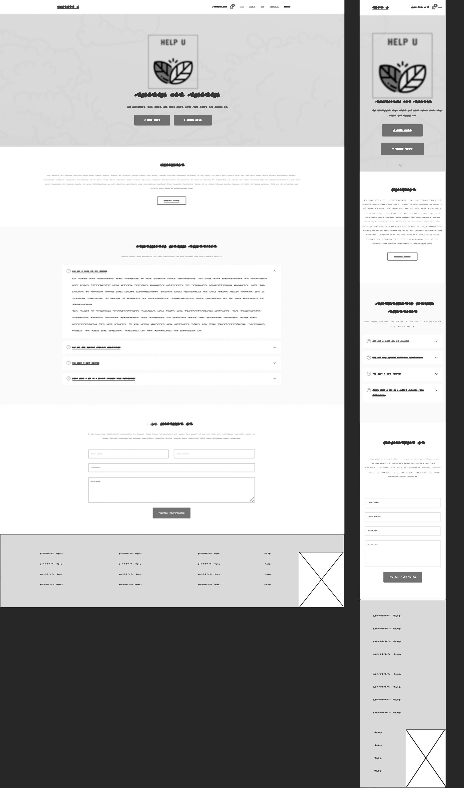
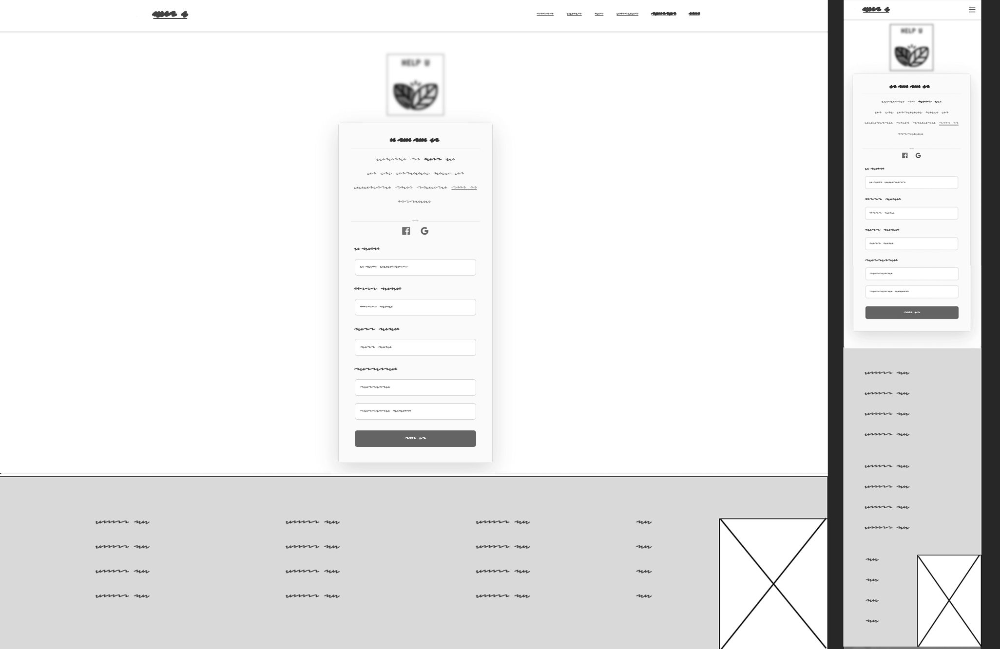
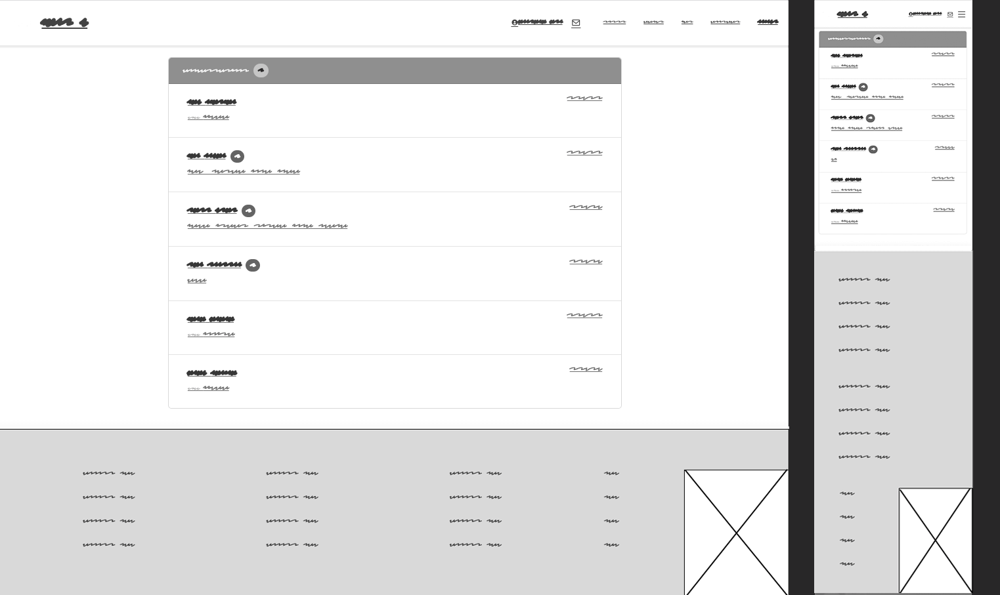
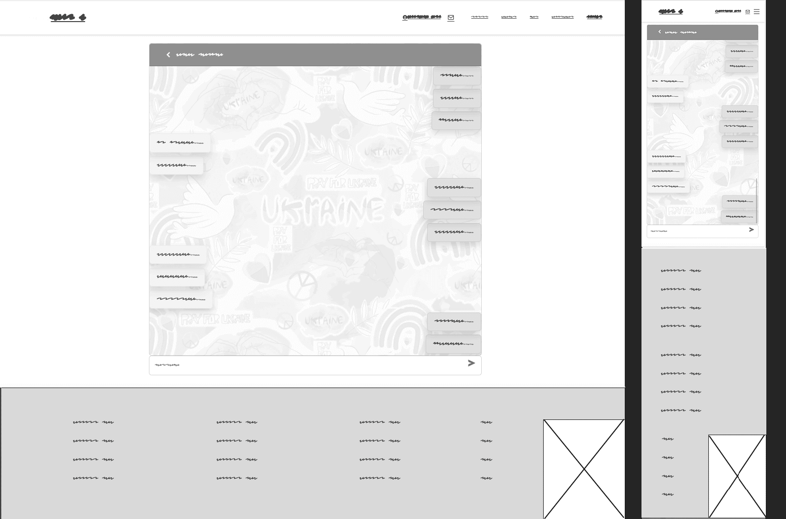

# Help U Website (Milestone Project 4)

[Help U](https://helpukr.herokuapp.com/) is a platform that aims to support Ukrainian refugees in Europe and connect people. The website serves as a bridge between those looking to make a difference and those who need help by providing a platform for offering or requesting free services and items such as clothing, furniture, and other necessities. The goal of the website is to create a community of support for Ukrainians who have fled the war and to make it easy for people to get the help they need. The ongoing conflict has had a devastating impact on ordinary people, and it is important to support their rights and dignity. It is a very personal and sensitive issue for many people, including myself, because it affects the country of my heritage and identity. It is important to me as a human being, to support the Ukrainian people and help them to rebuild their lives. 

## Table of contents

* [Purpose](#purpose)

* [UX Design](#ux-design)
  * [User Stories](#user-stories)
  * [UAC](#uac)
  * [Structure](#structure)

* [Wireframes](#wireframes)

* [Design](#design)

* [Development Plan](#development-plan)

* [Architecture](#architecture)

* [Data Model](#data-model)

* [Features](#features)
  * [Existing Features](#existing-features)
    * [Security Features](#security-features)
  * [Feature Considerations](#feature-considerations)

* [Testing](#testing)
  * [User Story Testing](#user-story-testing)
  * [Manual Testing](#manual-testing)
    * [Detected Bugs](#bugs-detected)
  * [Unit Testing](#unit-testing)
  * [Selenium Tests](#selenium-tests)
  * [Automated Testing](#automated-testing)

* [Technologies](#technologies)
  * [Languages](#languages)
  * [Programs, frameworks, libraries](#programs,-frameworks,-libraries)

* [Deployment](#deployment)

* [Credits](#credits)

# Purpose
The website is built using the Django framework, which provides the backend functionality, such as user authentication, data management, and routing, and handles the majority of the frontend. One key feature of the website is a React component that allows real-time communication and updates through the use of WebSockets. This allows a seamless and interactive user experience as certain parts of the website update in real-time without the need for page refreshes. Overall, the website combines the power and flexibility of Django with the dynamic capabilities of React and WebSockets to deliver a smooth and responsive user experience.

The website provides all the essential features, such as creating a personal account, searching and filtering posts, ability to add and manage posts, bookmark posts the users find usefull, comment on posts and send direct messages to other users in real time. 

The website is developed as a Milestone Project#4 for the Code Institute's Full Stack Developer course.  

[The live website is available here](https://helpukr.herokuapp.com/)
___
# UX Design
## User stories

Target audiences:
- Ukrainian refugees in Europe who are in need of assistance and other necessities. (U)
- Individuals who are interested in supporting Ukrainian refugees and want to find an easy way to make a difference. (I)
- Organizations or groups that provide aid to refugees and may be interested in using the platform to connect with potential donors or volunteers. (0)

All target groups have similar needs and purposes, with the only difference - the category of the post.

### As a **first time user**

- I want to be able to access the website from any device.
- I want to easily understand the main purpose of the site and learn more about the topic.
- I want to be able to easily navigate and find content.
- I want to create my personal account to see posts.
- I want to sign up with my social accounts, such as Google or Facebook.
- I want to create an account fast, but I want it to be secure.
- I want to be able to contact somebody and receive a response without signing up if I have doubts or queries.
- I want to easily access a category of posts I need and to be able to search through them.
- I want to open a post in a separate page to see all the details.
- I want a map attached to each posts to understand where the offer/request is.
- I want to be able to create a post myself.
- I want to contact another user if I see something that interests me.
- I want to know more about other users that I interact with.
- I want to be immediately notified when another user responds.
- I want to learn more about the project on social media.
- I want to receive feedback from the website about what's happening to know if something went wrong.

- I want a messenger to translate messages to ukrainian for me. (U)

### As a **returning user**

- I want to be sure my data is protected.

- I want to be notified about the messages I received.

- I want to access the messenger from anywhere on the website.

- I want to be able to access the navbar at any point or go back to the top to navigate fast.

- I want posts to be paginated so it helps me remember on what page I saw something interesting or stay on the same page if I accidentially refresh the page or there are problems with internet connection.

- I want to be able to report content that I find offensive, unsafe or inappropriate.

- I want content to be moderated, so I don't need to report it.

- I want to be able to write comments to describe my experince of interacting with an offer.

- I want to be able to update and delete my posts.

- I want to bookmark posts and easily access them.

- I want to be able to update my user profile.

- I want to be able to reset my password if I forget it.

___
## UAC
User Acceptance Criteria based on the user stories:

1. The website should be fully responsive and accessible on any device, including desktop, tablet, and mobile.

2. The website should have a clear and concise homepage that explains the main purpose and topic of the site.

3. The website should have a clear and intuitive navigation menu that allows users to easily find and access content.

4. The website should have a navigation bar that is always visible and easily accessible from any page on the site, and a button to quickly scroll back to the top of the page.

5. The website should have a registration form that allows users to create a personal account.

6. The website should allow users to sign up with their existing social media accounts, such as Google or Facebook.

7. The registration process should be fast and easy, but also secure, using encryption and other security measures.

8. The website should have a contact form or email address that allows users to contact the site's support team without needing to sign up.

9. The website should have a search bar that allows users to easily find and access specific categories of posts.

10. Each post should have a link that allows users to view it in a separate page, where they can see all the details and information about the post.

11. Each post should have a map attached that displays the location of the offer or request.

12. The website should have a form that allows registered users to create their own posts.

13. Each post should have a contact button or form that allows users to contact the author of the post.

14. The website should have a user profile page that displays information about other users that a user interacts with.

15. The website should display live notifications to users when another user responds to their message.

16. The website should have links to its social media pages, such as Facebook, Twitter, Instagram, etc.

17. The website should have a feedback form or email address that users can use to report any issues or problems they encounter while using the site.

18. The website should have a messenger feature that allows users to communicate with each other.

19. The messenger should support Ukrainian language and should be able to translate messages to Ukrainian.

20. The website should be localized to support Ukrainian language and have the option to switch to Ukrainian.

21. The website should have robust security measures in place to protect user data, such as encryption and secure servers.

22. The messenger should be easily accessible from any page on the site.

23. The website should divide the posts into pages so that users can easily navigate through them.

24. The website should have a reporting system that allows users to flag content that they find offensive, unsafe or inappropriate.

25. The website should have a moderation system that reviews and approves or removes content that does not meet the standards of the website.

26. The website should allow registered users to leave comments on posts, in order to share their experience and feedback.

27. The website should allow registered users to edit and delete their own posts, if they need to.

28. The website should allow registered users to bookmark posts and have easy access to them for later reference.

29. The website should allow registered users to update their profile information and personal details.

30. The website should have a password reset feature that allows registered users to reset their password in case they forget it.

___
## Structure
  ** Some paddings slightly differ from the original website, it didn't display acccurately in x-frames of a mockup generator.

### Home Page

- Explains the main purpose and topic of the site.
- Adresses question and doubts the first time users might have and provides a contact form.
- Presents opportunities of possible further actions 
    #### User Goal:
    >   - Understand the main purpose of the website.
    >   - Be able to contact the site owners to ask more questions or report technical problems signingup/in.
    >   - Easily navigate and interact with the website.
    >   - Learn more about the project on social media.
    #### Website Goal:
    >   - Inform the user about the main purpose.
    >   - Interest and engage the user.
    >   - Call to action.
    >   - Initiate future engagement, such as following on social media, joining the club, attending meetups etc.
    >   - Provide aesthetically pleasing user experience.

### Sign Up Page

- Allows to sign up.
- Allows to sign up with existing social media account.
    #### User Goal:
    >   - Sign up.

    #### Website Goal:
    >   - Allow the user to sign up easily.
    >   - Provide aesthetically pleasinguser experience.

### Sign In Page

- Allows to sign in.
- Allows to sign in with existing social media account.
    #### User Goal:
    >   - Sign in.
    #### Website Goal:
    >   - Allow the user to sign in easily.
    >   - Provide aesthetically pleasinguser experience.

### Posts Page

- Shows posts.
- Allows users to easily find and access specific categories of posts.
- Allows to open each post in a separate page.
- Available only for authenticated users.
    #### User Goal:
    >   - Browse the posts.
    >   - Easily find and access specific categories of posts
    >   - Open posts to see them in detail.
    #### Website Goal:
    >   - Provide a list of posts.
    >   - Provide comprehensive information on each post in a preview.
    >   - Provide aesthetically pleasing user experience.

### Post Detail Page

- Shows a post in detail including an image and a map.
- Allows to see and write comments about the post.
- Allows to bookmark the post.
- Allows to contact the author of the post in a messenger.
- Allows to manage the post if you are the author.
- Available only for authenticated users.
    #### User Goal:
    >   - See a post in detail.
    >   - See comments other users left about the post.
    >   - Leave your own comments.
    >   - Bookmark a post.
    >   - Contact the author of the post.
    >   - Manage the post, if you are the author.
    #### Website Goal:
    >   - Show a post in detail.
    >   - Allow the user to interact with the post.
    >   - Allow users to contact each other.
    >   - Provide aesthetically pleasing user experience.

### Create/Update Post Page

- Creates a new post.
- Allows to update an existing post.
- Available only for authenticated users.
    #### User Goal:
    >   - Create a new post.
    >   - Update your posts.
    #### Website Goal:
    >   - Allow the user to create/update a post.
    >   - Provide aesthetically pleasing user experience.

### Delete Post Page

- Confirms if the user wants to delete their post.
- Available only for authenticated users.
    #### User Goal:
    >   - Delete a post.
    >   - Being able to change your mind if you pressed "Delete" accidentially.
    #### Website Goal:
    >   - Confirm with the user deletion of the post.
    >   - Provide aesthetically pleasing user experience.

### Profile Page

- Shows a user profile.
- Shows the user's bookmarked posts.
- Allows to contact the user.
- Available only for authenticated users.
    #### User Goal:
    >   - See a profile in detail.
    >   - See your own bookmarked posts.
    >   - Leran more about other users you are going to interact with.
    >   - Contact another user.
    #### Website Goal:
    >   - Allow users to see their owm and each other's profile.
    >   - Allow the user to see saved posts.
    >   - Allow users to contact each other.
    >   - Provide aesthetically pleasing user experience.

### Profile Create/Update Page

- Manages a user profile.
- Available only for authenticated users.
    #### User Goal:
    >   - Create a new profile (it's created automatically, but the user is asked to complete an empry profile).
    >   - Update your profile.
    #### Website Goal:
    >   - Allow the user to complete/update a profile.
    >   - Provide aesthetically pleasing user experience.

### Messenger Page

- Displays a react component - real time Messenger.
- Allows users to send and receive messages in real time.
- Available only for authenticated users.
    #### User Goal:
    >   - Send and receive messages.
    >   - See a list of active conversations.
    >   - Receive message notifications in real time.
    #### Website Goal:
    >   - Allows users to send and receive messages.
    >   - Displays a list of active conversations and individual chats.
    >   - Provides message notifications in real time.
    >   - Provide aesthetically pleasing user experience.

___
# Wireframes

       
## Home Page

## Sign In Page

## Sign Up Page

## Posts Page

## Post Detail Page

## Profile Page

## Messenger

## Chat

___
# Development Plan

[See the current state of the project here.](https://github.com/users/oks-erm/projects/2/views/2?sortedBy%5Bdirection%5D=asc&sortedBy%5BcolumnId%5D=Labels&visibleFields=%5B%22Title%22%2C%22Labels%22%2C%22Assignees%22%2C%22Status%22%2C%22Reviewers%22%5D)
___
# Design

## Design

The website is meant to have a simple layout and a clean design. The home page is aimed at giving a professional and informative impression, whilst cozy and friendly as you log in, which is achieved by little details, such as a cheerful logo and a footer image. A main frame for design, mainly composition and alignment-wise, was a template [One Page](https://bootstrapmade.com/onepage-multipurpose-bootstrap-template/), which was heavily modified with unique imagery and "Ukrainian twist".

### Colour Scheme

The color scheme is mainly blue and white, with a touch of yellow to create a visually appealing and cohesive design that is easily recognizable as being associated with Ukraine. The color scheme is an effective way to create a visual association with the country, it helps to create a sense of familiarity and trust among the visitors. Overall, this color palette creates a sense of calm and trust, with a touch of happiness and energy. The blue shades are associated with reliability, stability and security, while the yellow color adds a touch of cheerfulness and enthusiasm. 

### Typography

[Poppins](https://fonts.google.com/specimen/Poppins) was used for logo and headings for a modern, simple and clean look.

[Raleway](https://fonts.google.com/specimen/Raleway) elegant, with clean lines and a minimalistic design was used for second level headings.

[Open Sans](https://fonts.google.com/specimen/Open+Sans) neutral and friendly, and a slight informal feeling, was used for the navbar and main body text. Lightweight, easy to read and particularly legible at small sizes and also exists in Ukrainian alphabet, which is not the case for many other fonts. 

### Images

The images in this project were sourced from [Unsplash](https://unsplash.com/) and [Undraw](https://undraw.co/), generated by [Midjourney](https://midjourney.com/home/?callbackUrl=%2Fapp%2F) and [This Person Doesn't exist](https://this-person-does-not-exist.com) or created by me. The logo is designed in [Hatchful](https://www.shopify.com/tools/logo-maker)

### Visual Effects

#### Onscroll Animation
[AOS (Animate on Scroll)](https://michalsnik.github.io/aos/) is used to animate the appearance of different sections on the website as the user scrolls down. This helps to make the website more engaging and enhance the user experience by adding visual interest and dynamic movement to the website. 

#### Shadows
Shadows are used to create a sense of depth and dimension and make elements on the page appear more realistic and three-dimensional. The shadows on the cards and the navbar give them a raised effect, which makes them stand out from the background, especially when white is the dominant colour. Shadows create visual hierarchy, helping to guide the user's attention to the most important elements on the page. Additionally, shadows create a sense of realism, making the elements look like they are actually present in the physical space, making the design look more visually interesting and engaging.

#### Logo
The logo is composed of two leaves arranged to form a heart shape. The use of the yellow and blue colors, which are the colors of the Ukrainian flag, suggests a strong connection to the country and its people. The heart shape is a universal symbol of love and care, that is effectively represents the project's mission and values, this is a powerful and positive message that the project is trying to convey, it's a way to show that we are here to help and support the people of Ukraine.

The simplistic graphic style of the leaves gives the logo a modern and clean look, making it easy to recognize and remember. The leaves also represent life, which align well with the organization's mission of providing help and support. This logo is used throughout the website in the way that almost at any point at the website the logo is present in the view. It conveys a message of love, care, and support while also being visually appealing and easy to recognize.

#### Smooth fade in/out
The use of a smooth fade in and out effect for a Google map toolkit and cards during live search refreshing can provide a sense of continuity and flow to the user experience. The fade in effect can be used to smoothly reveal the updated information to the user, rather than abruptly showing the new data. This can help to prevent confusion and disorientation for the user. The fade out effect is used to smoothly hide the previous data while refreshing the search, which can prevent the user from seeing the previous data that is irrelevant to their current search. This can help to improve the user's focus on the updated information.

#### Hover effect
The navbar links, all links and buttons include a hover-over effect to make the experience more interactive and navigation more intuitive. When the user engages with the link or hovers over the link, its colour or background colour changes.
___
# Architecture

A hybrid architecture - a single page React app (Messenger) integrated into a Django project. This approach allows for multiple types of pages in the same project.

One major advantage of using a hybrid architecture is that it allows for the use of Django's built-in tooling to handle authentication. This means that we can use the @login_required decorator or LoginRequiredMixin on the hybrid Django view serving our template, without having to rely on complex third-party authentication workflows.

Another advantage of a hybrid architecture is the ability to send data to the front-end in two ways: by passing the data directly to the template using Django's built-in templating system, or by providing the data via asynchronous APIs using JavaScript and Django REST framework. This allows for fast data loading using the native fetch API, and the API is loaded by URL and authentication is handled without configuration by the Django session cookie, no wrestling with CORS.

In terms of performance, by using React for the front-end of a web application, in this case just a part - a real-time Messenger, we can take advantage of its performance benefits and provide a smooth and responsive experience for the user. Additionally, React is a highly modular library, and by building a single page app, you can easily scale the different parts of the application independently as needed. This can make it easier to add new features or make changes to the application without affecting other parts of the codebase. It also allows for easier debugging and testing.

As well as the mentioned above, that I prioritised in my project, React for the front-end of can significantly improve the user experience. 
 Here a scheme of the structure:
 

___
# Data Model

___
# Testing